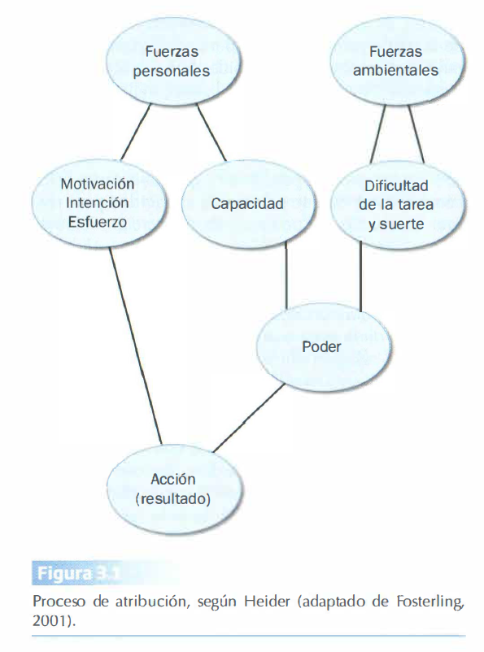
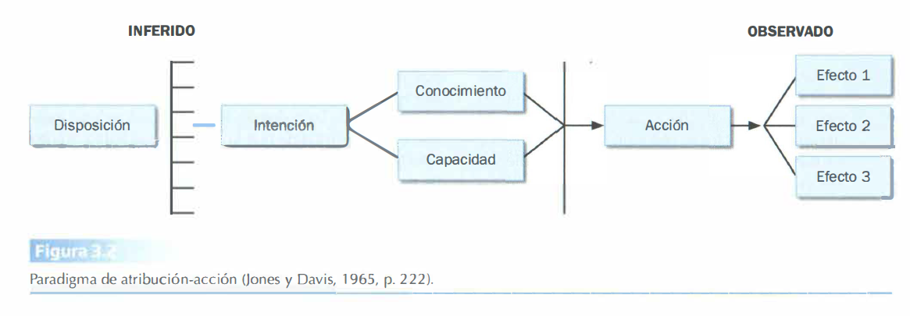
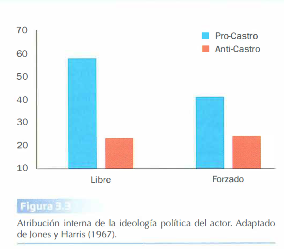
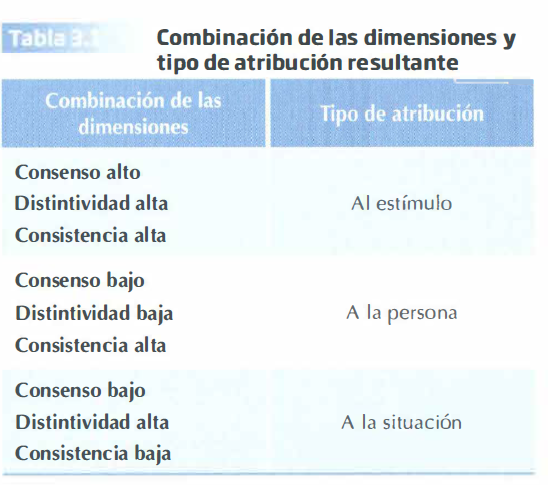
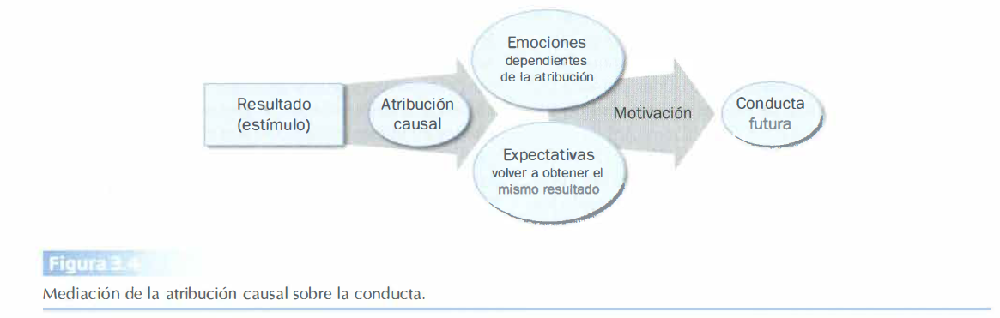
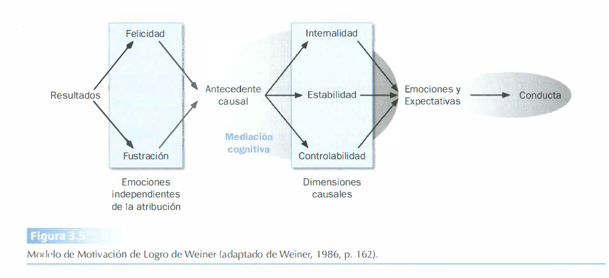
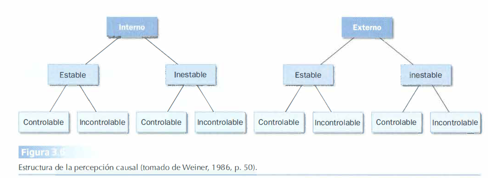
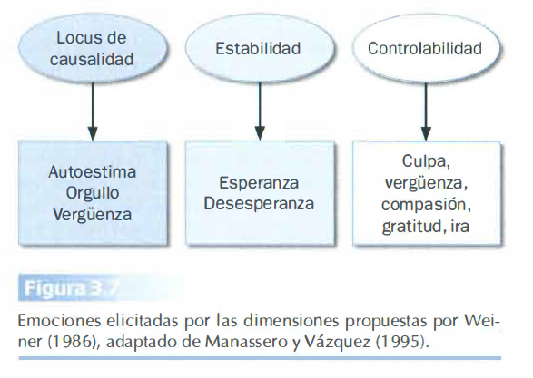
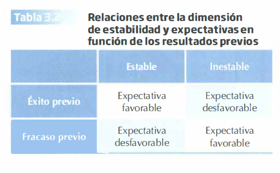

--- 
title: "Resumen del Tema 3 de Psicología Social"
subtitle: "PROCESOS DE ATRIBUCIÓN"
author: ""
date: "`r Sys.Date()`"
site: bookdown::bookdown_site
documentclass: book
#bibliography: [book.bib, packages.bib]
# url: your book url like https://bookdown.org/yihui/bookdown
# cover-image: path to the social sharing image like images/cover.jpg
description: |
 Este resumen del tema es sólo para uso como material de apoyo en las tutorías. Para estudiar y preparar el examén  se recomienda usar el libro referenciado en la guía de la asignatura.
link-citations: yes
github-repo: dalarconrub/psicologia-social-tema-3

output:
  prettydoc::html_pretty:
    theme: hpstr
    highlight: github
    toc: true
   
---

# TEMA 3: PROCESOS DE ATRIBUCIÓN 

---

Los **procesos de atribución** forman parte de la **cognición social** y están estrechamente relacionados con la **percepción** de personas y grupos.

Una **atribución** es una explicación que elaboramos sobre **las causas de la conducta** de los demás y de uno mismo. Nos ayuda a dar sentido, manejar y predecir el mundo social.

Día a día nos encontramos con situaciones que nos llevan a preguntarnos: “¿por qué?”. Algunos ejemplos comunes incluyen: un vecino que no nos saluda, un compañero que nos pone mala cara, dos personas discutiendo en la calle, alguien con un paraguas bajo el sol, o el momento en que vamos a comer y descubrimos que no tenemos hambre. Cuando generamos atribuciones, independientemente de si podemos confirmarlas o no, nos resulta más fácil continuar adelante.

Estas situaciones suelen tener tres características principales:

- Son **inesperadas**.

- Suelen ser **negativas**.

- Nos hacen sentir una **pérdida de control** sobre los acontecimientos.

#### Las Preguntas Fundamentales de Weiner (1980)

Weiner plantea tres preguntas fundamentales en el estudio de la atribución:

1. ¿Cuáles son las **causas** percibidas de un hecho?
2. ¿Qué **información** se toma en cuenta al buscar explicaciones para los acontecimientos?
3. ¿Qué **consecuencias** tiene la atribución causal?

En los procesos atributivos, la causa es **inferida** y no directamente observable; se centran principalmente en fenómenos cotidianos y psicológicos, a los que las personas dan **explicaciones ingenuas** o de **sentido común**.

Estas teorías sobre la atribución se conocen como “**Psicología ingenua de la vida diaria**,” donde los seres humanos se consideran **científicos ingenuos** que emplean inferencias de sentido común para explicar la conducta de las personas (Fiske y Taylor).

El **objetivo** de estos modelos es construir una teoría científica sobre cómo funciona el **sentido común** en el pensamiento cotidiano.  

Se destaca la importancia de los **factores motivacionales** y **emocionales** en la atribución, ya que permiten la **adaptación humana**, brindando a las personas sentido y percepción de control sobre su entorno.

Hewstone (1989) destaca la amplitud, importancia e implicaciones que tienen los procesos de atribución para el comportamiento humano:

- Las atribuciones participan en los procesos de percepción y evaluación de los hechos sociales, y lo hacen de forma diferente según si las personas son **actores** u **observadores** del hecho.
- Las atribuciones están influenciadas por la **categorización o asociación** de las personas con un grupo.
- Cuando se transmiten a través de la comunicación interpersonal, pueden llegar a ser compartidas por todo el grupo en forma de **representaciones sociales**.

En todos los análisis, **la atribución es social**, si se considera que:

1. Su **origen** reside en la información social y es influenciada por la interacción social.
2. Su **objeto** es un acontecimiento relacionado con personas o con consecuencias sociales.
3. Es **compartida** por los miembros de un grupo o sociedad.

### 1. ¿Cuándo se Produce el Proceso de Atribución Causal?

Los seres humanos perciben el mundo en términos de **causa** y **efecto**, lo que lleva a los investigadores de la atribución a preguntarse si existen **análisis causales espontáneos** y cuáles son las causas que los provocan.

De esta forma, los informes y trabajos en los que no se pide ni se fuerza a los participantes a realizar atribuciones muestran que **sí se produce un análisis espontáneo de los acontecimientos**. Además, los individuos no siempre son conscientes de su intención de realizar atribuciones, ni siquiera se dan cuenta de haber hecho una inferencia causal (Uleman, 1989). 

Las personas buscan causas tanto cuando se trata de las **características de una persona**, como cuando es un **acontecimiento físico** o una **acción**.

Sin embargo, **esto no ocurre en todas las situaciones**: *no nos preguntamos por qué una persona espera en la cola del autobús o en la taquilla del cine*.

#### Situaciones con Mayor Probabilidad de Generar un Proceso Atributivo

1. **Acontecimientos inesperados** o que se desvían del curso normal de la acción:
   - Ejemplos: que nuestro mejor amigo nos niegue ayuda o que un tratamiento médico empeore nuestra salud.

2. **Objetivos no logrados**: como suspender un examen o perder una competición deportiva.
   - Según Fosterling (2001):
     - Si **encontramos una explicación** que nos permita mantener nuestras teorías ingenuas previas:
       - El proceso puede automatizarse.
       - Estas teorías guiarán nuestro comportamiento sin que seamos conscientes de ello.
     - Si el hecho **no encaja en nuestros sistemas previos**:
       - Necesitaremos revisar nuestras teorías e iniciar una búsqueda voluntaria que dé respuesta al evento ocurrido.

Las explicaciones de lo **inesperado** se han asociado con **respuestas básicas a estímulos nuevos** hasta el punto de considerar que el análisis atributivo puede ser un ejemplo de **conducta exploratoria general** provocada por la **incertidumbre** (Weiner, 1985), siendo el **control** un principio motivacional (Heider, 1958).

La **necesidad de control** se entiende como una motivación que puede satisfacerse a través de la explicación cuando recibimos un estímulo que genera incertidumbre; en este sentido, **la atribución tiene un carácter funcional**.

3. **Fallos o fracasos** (comparados con éxitos) también tienden a provocar atribuciones causales (Wong y Weiner, 1981).
   - Por ejemplo, los pacientes que incumplían un tratamiento médico realizaban más atribuciones sobre su comportamiento que los pacientes que sí lo cumplían (Nouvilas, 2003).

En general, buscamos explicaciones para **acontecimientos negativos** (como las catástrofes), pero los **éxitos** también pueden ser experiencias igualmente intensas que suscitan explicaciones causales.

#### Estudio: Atribución de Éxito/Fracaso en Examen (Manassero y Vázquez, 1995)

Este estudio observó que los alumnos que habían obtenido un resultado objetivo de éxito, pero lo percibían como fracaso, desarrollaban una actividad atributiva. Esto podía deberse a la desconfirmación de expectativas o a lo inesperado del resultado.

- *Por ejemplo, un notable puede percibirse como un fracaso si el estudiante esperaba un sobresaliente.*  
No es la realidad objetiva la que influye en nuestros pensamientos, sentimientos y conductas, sino nuestra interpretación de esa realidad.

---

### 2. ¿Qué Funciones Tienen las Atribuciones?

Las atribuciones nos ayudan a sentir que tenemos control sobre nuestro entorno (**control efectivo**), que salimos airosos de las situaciones (**autoensalzamiento**) y que mantenemos una buena imagen ante los demás y ante nosotros mismos (**imagen positiva**).

Kelly y Michela (1980) asocian estas motivaciones con las **funciones de la atribución**:

1. **Función de Control**: El objetivo del análisis causal es el control efectivo.
   
   *(Percepción de control = Consecuencias positivas / Pérdida de control = Consecuencias negativas)*

   Realizar una atribución (encontrar una explicación), ya sea correcta o incorrecta, facilita la **predicción de acontecimientos similares** y nos brinda una percepción de control.

   Dentro de la función de **control**, Forsyth (1980) define dos subfunciones: **explicación** y **predicción**:

   - El conocimiento que se adquiere en la **explicación** se utiliza para controlar nuestro entorno y manejar nuestras acciones.
   - El **científico ingenuo** se convierte en un **científico aplicado** cuyo análisis causal le permite:
     - **Anticipar** lo que ocurrirá.
     - **Confirmar** sus atribuciones ingenuas, aumentando su **percepción de control**.

2. **Función de Autoestima**: Motivación **egocéntrica** (Forsyth, 1980).  
   El análisis racional de la información puede **sesgarse** para proteger y mantener la autoestima. Esto es especialmente evidente en contextos de logros:

   - **Atribuciones de éxito**: Se suelen atribuir a factores **internos** y **estables**.
     - *Ejemplo: “He aprobado porque tengo buen nivel.”*
   - **Atribuciones de fracaso**: Se tienden a atribuir a factores **externos** e **inestables**.
     - *Ejemplo: “He suspendido porque el examen era demasiado rebuscado.”*

3. **Función de Autopresentación**: Motivación para presentarse de manera favorable (Kelley y Michela, 1980), con el fin de ser aceptado por los demás, lo cual responde a un motivo básico de pertenencia.

   A través de nuestras explicaciones, intentamos influir en las atribuciones que otras personas hacen sobre nosotros y nuestro comportamiento. Al **manipular la información** que los demás reciben mediante nuestra **autopresentación**, controlamos su percepción.

### 3. Teorías Clásicas de la Atribución

#### 1. Psicología Ingenua de la Acción (Heider)

**Heider (1958)** sentó las **bases fundamentales** sobre las que se desarrollan las teorías de la atribución. Su teoría de la **Psicología Ingenua** se basa en la idea de que las personas intentan **comprender, controlar y predecir** los acontecimientos que les afectan.

Esta teoría establece un paralelismo entre un **científico** y las **personas en general**: ambos utilizan la **observación** para formar teorías o creencias sobre el mundo, las cuales pueden confirmar, refutar o modificar con cada nueva observación. Estas creencias o teorías, a su vez, influyen en el comportamiento de las personas.

#### El Análisis Ingenuo de la Acción

Uno de los conceptos clave de esta teoría es el **locus de causalidad**, que se refiere a la búsqueda de la causa que origina un comportamiento.

*Ejemplo: Comprender «por qué» una persona se comporta de una determinada manera.*

Cuando realizamos una acción (por ejemplo, ayudar a un compañero en un trabajo de ciencias), la causa de este comportamiento puede tener distintas **localizaciones**:

- **Interna, disposicional o personal**: como nuestros conocimientos en la materia y nuestra motivación para ayudar.
- **Externa, situacional o ambiental**: como que el trabajo sea fácil o que tengamos suerte.

La causa también puede ser una combinación de factores ambientales y personales. En general, a medida que aumenta la percepción de la participación de **aspectos personales**, disminuye la influencia percibida de los **aspectos ambientales**, y viceversa. En última instancia, es la **conjunción de fuerzas ambientales y personales** la que determina la acción.

- A medida que aumenta la percepción de aspectos personales, disminuye la contribución percibida de los aspectos ambientales en la explicación de la acción.

#### Componentes de las Fuerzas Personales y Ambientales

**Fuerzas personales**:

- **Capacidad**: Habilidad física y mental para realizar una acción; es un componente estable.

- **Motivación**: Impulso que dirige la acción; es un componente variable y controlable.

  - **Intención** y **esfuerzo** son subcomponentes de la motivación.

**Fuerzas ambientales**:

- **Dificultad de la tarea** o del objetivo; es un componente estable.

- **Suerte**; es un componente variable.

La relación entre estos dos tipos de fuerzas permite realizar una atribución a la persona o a la situación.

#### El Esfuerzo: Relación entre Factores Personales y Situacionales

El esfuerzo guarda una relación directa con la dificultad de la tarea y una relación inversa con la capacidad del individuo:

- A mayor dificultad de la tarea, mayor será el esfuerzo necesario.

- A mayor capacidad, menor es el esfuerzo requerido.

Existe la posibilidad de tener éxito en la acción cuando la capacidad del actor supera la dificultad de la tarea o si esta se combina con la suerte.

**Éxito cuando la capacidad más la suerte es mayor que la dificultad de la tarea**

Estas relaciones en el proceso atributivo permiten:

- **Predecir** el éxito o fracaso de una acción específica.

- Realizar un **análisis causal** tras haber ejecutado la acción.

Por ejemplo, para ayudar a un compañero en su trabajo de ciencias, es necesario contar con la motivación y capacidad para hacerlo. Sin embargo, la posibilidad de éxito dependerá de cómo se combinen la motivación y la capacidad con los factores ambientales, como la dificultad de la tarea o la intervención de la suerte.

Un observador hará una **atribución interna** de la conducta de un actor si percibe que este tiene la **capacidad** y la **intención o motivación** para llevar a cabo la acción.

Por el contrario, se atribuirá la conducta a una **causa externa o ambiental** si la **dificultad de la tarea** supera la **capacidad** del actor, o si no se percibe en él la **motivación** para realizar la conducta.

#### 2. La Atribución de Responsabilidad

Sabemos quién ha sido el actor de un acontecimiento si lo observamos, pero no siempre podemos determinar hasta qué punto esa persona es **responsable** de lo ocurrido o si ha sido un **accidente**. El **nivel de responsabilidad** aumenta a medida que la acción se atribuye más a **fuerzas personales** (motivación y capacidad) que a fuerzas situacionales (dificultad de la tarea o suerte).

- Mayor atribución a fuerzas personales → Mayor responsabilidad

Heider distingue **cinco niveles de responsabilidad**:

1. **Asociación**: No existe una conexión causal con la conducta. Se atribuye la responsabilidad a alguien que no realizó la acción, pero que tiene alguna relación con el actor real o la situación.  
   - Ejemplo: Un niño rompe un cristal con un balón y el profesor castiga a todos los niños que estaban jugando.

2. **Causalidad Simple**: El actor ha realizado la acción de la que se le hace responsable, pero **no tuvo intención** de hacerlo.  
   - Ejemplo: Un niño que está aprendiendo a montar en bicicleta lesiona a otro sin querer al pasar junto a él.

3. **Previsibilidad**: Similar al nivel anterior, pero en este caso el **observador juzga** que el actor **podría haber previsto** lo ocurrido.  
   - Ejemplo: Un niño que baja rápido una cuesta en bicicleta lesiona a otro al intentar impresionar a sus amigos.

4. **Intencionalidad**: Se le **atribuye intención al actor**. El observador realiza una atribución interna de la acción, considerando que existen motivación y oportunidad.  
   - Ejemplo: El niño tenía intención de causar daño con su acción.

5. **Justificabilidad**: La acción intencionada puede **justificarse** por las circunstancias de la situación.  
   - Ejemplo: Un niño hace una maniobra en bicicleta que lesiona a otro para evitar que éste golpee a su hermano pequeño.

---

#### 3. El Principio de Covariación

Según este principio, puede atribuirse un efecto a una causa que está **presente** cuando el efecto tiene lugar y **ausente** cuando el efecto no ocurre. Este principio de Heider es la base de:

- El **Modelo de Covariación de Kelley**
- La **Teoría de las Inferencias Correspondientes** de Jones y Davis, que profundiza en la atribución disposicional interna.

---

#### 4. Teoría de las Inferencias Correspondientes (Jones y Davis)

Jones y Davis continúan la línea de trabajo de Heider, centrándose en las **atribuciones internas**. Para ellos, realizar una **inferencia disposicional o atribución interna** es un proceso que consta de dos etapas principales:

1. **Atribución de intención**
2. **Inferencia correspondiente**

En esta teoría, **el objetivo del perceptor** es **inferir el antecedente causal**, es decir, la causa que explique el comportamiento del actor. La búsqueda de la causa se completa cuando se determina que un motivo es la razón suficiente que explica un acontecimiento.

- Se buscan explicaciones **estables e informativas**.

La conducta del actor será más informativa si se considera **intencionada** y se debe a una intención **consistente** (no variable), es decir, que corresponde a alguna cualidad estable subyacente del actor.

#### Proceso de Obtención de Información para la Atribución

El modelo plantea que el perceptor observa una acción y sus efectos, y debe decidir qué efectos intentaba el actor conseguir con su conducta. Para que esto ocurra, el **actor** debe tener:

- **Conocimiento** de los efectos de su acción.

- **Capacidad** para lograr el efecto deseado.

En este modelo, el **conocimiento** y la **capacidad** se consideran precondiciones para la **atribución de intención**, al igual que la **intención** es una precondición para realizar inferencias sobre las **características estables subyacentes** de la persona.

- La combinación de **conocimiento** y **capacidad** permite la **atribución de intención**.

- La **intención** conduce a realizar **inferencias sobre características estables subyacentes de la acción**.

#### La Inferencia Correspondiente

El concepto fundamental de la teoría de las inferencias correspondientes es el de **correspondencia**, entendido como la unión entre un **atributo o característica personal** y un **efecto**, lo cual se utiliza para explicar por qué ocurre un acto.

En otras palabras, cuando se hace una inferencia correspondiente, el perceptor juzga que la conducta del actor está causada por *(o se corresponde con)* un **rasgo interno y estable** *(una disposición)* de esa persona, un rasgo que ha **inferido** a partir de su conducta.

Para realizar una inferencia correspondiente, utilizamos **cinco elementos informativos**:

1. La conducta **elegida libremente** es más indicativa de una **disposición** que un comportamiento impuesto por amenazas, incentivos o restricciones externas. Este factor es el elemento central de la teoría, ya que es **necesario para inferir una disposición interna**.

2. Los **efectos no comunes o distintivos** de la acción aumentan la probabilidad de realizar una inferencia correspondiente.

   - Los **efectos comunes** de distintos comportamientos:
     - No proporcionan información sobre la intención del actor.
     - Podrían no haber sido decisivos para la elección de una acción específica.
     - Se habrían obtenido igualmente con una acción alternativa.

   - Los **efectos distintivos** (aquellos que no comparten dos acciones alternativas):
     - Proporcionan la información necesaria para realizar una inferencia correspondiente.
     - **Si existen varios efectos distintivos**: la información para hacer una inferencia correspondiente se complica, ya que es difícil determinar cuál de ellos era el que el actor, debido a sus características personales, tenía la intención de lograr.

La probabilidad de hacer una inferencia correspondiente **aumenta** cuando existen **pocos efectos no comunes** entre dos alternativas de acción.

Si los comportamientos producen una pequeña cantidad de efectos diferentes (es decir, pocos efectos no comunes; por ejemplo, el comportamiento A produce solo terror y el comportamiento B solo produce alegría), **entonces la elección del comportamiento nos informa sobre la disposición de esa persona**.

3. **Efectos poco deseables de la acción**: Los efectos poco deseables aumentan la probabilidad de hacer una inferencia correspondiente.
   - El comportamiento **socialmente deseable** dice poco sobre la disposición de una persona, ya que probablemente esté influido por normas sociales.
   - El comportamiento **socialmente indeseable** es una mejor base para realizar una inferencia correspondiente. Existe una relación entre **los efectos no comunes** y la **deseabilidad** como factores determinantes de la **correspondencia**: la mayor correspondencia se producirá cuando los efectos no comunes sean pocos y la deseabilidad social sea baja.
     - La correspondencia es más probable con pocos efectos no comunes y baja deseabilidad social.

4. **Relevancia Hedónica**: Se realizan más inferencias si la conducta del actor tiene consecuencias positivas o negativas para el observador.
   - Cuando la conducta tiene relevancia hedónica para el observador, este agrupa los efectos tanto de la acción elegida como de la no elegida según el **significado afectivo** que tienen para él. Al agrupar los efectos, **se reducen los no comunes**, y es más probable una inferencia correspondiente.
   - **Acción con múltiples efectos**: Se tiende a tomar como base de la inferencia el efecto con mayor relevancia hedónica para el perceptor (Ross y Fletcher, 1985).

     *Ejemplo:* Si un estudiante universitario decide hacer un doctorado en Psicología Social en lugar de en Psicología Básica, y el observador es profesor de la primera especialidad, de todos los posibles efectos que esa elección pueda tener para el estudiante, el profesor valorará más un efecto como el interés en sus clases que otros, como el hecho de que esa especialidad ofrezca mejores oportunidades laborales.

5. **Personalismo**: Hacemos más inferencias correspondientes cuando el comportamiento de los demás parece tener la **intención directa** de beneficiarnos o perjudicarnos.

**Diferencia entre Personalismo y Relevancia Hedónica**: En el caso de la **relevancia hedónica**, la conducta del actor tiene consecuencias para nosotros, pero no necesariamente con la intención directa de dañarnos o beneficiarnos.

Por ejemplo, una persona que busca causar miedo o felicidad en los demás muestra, a través de su elección de comportamiento, indicios sobre su personalidad o sobre cómo le gusta interactuar con los demás.

En algunas universidades estadounidenses, los alumnos prefieren no tener muchos compañeros asiáticos en clase, ya que suelen sacar muy buenas notas, lo cual implica que el punto de corte para aprobar puede subir (por ejemplo, a un 7). Las calificaciones de estos estudiantes no tienen la intención de perjudicar al resto, pues todos buscan obtener buenas calificaciones. En este caso, las notas tienen **relevancia hedónica** para los demás, pero no **personalismo**.

---

La teoría de las inferencias correspondientes ha recibido apoyo parcial en la investigación. Por ejemplo, esta teoría establece que la combinación de **efectos no comunes** y **baja deseabilidad social** aumenta la probabilidad de que se hagan inferencias correspondientes, siempre y cuando el comportamiento haya sido **libremente elegido**.

- La probabilidad de inferencias correspondientes aumenta con la presencia de efectos no comunes, baja deseabilidad social y libre elección del comportamiento.

#### Experimento: Fidel Castro (Jones y Harris, 1967)

En este experimento, se presentaron a los participantes dos ensayos, uno a favor y otro en contra de Fidel Castro, indicándoles al final si el autor había sido obligado a escribirlo o si lo había hecho libremente.

- **Variable dependiente**: La ideología política atribuida al autor del ensayo.

**Expectativa de los investigadores**: Que los participantes atribuyeran simpatía por Castro al autor que escribió el ensayo a favor, siempre que este lo hubiese escrito libremente (efecto no común y baja deseabilidad).

El **supuesto central** de la teoría es la **libre elección**.

**Resultados**: Los participantes indicaron que el autor simpatizaba con Castro cuando el ensayo estaba a favor de él, incluso en los casos donde el autor había sido obligado a escribir en ese sentido. 

Estos resultados sugieren que un **efecto no común y poco deseable** puede también promover una inferencia correspondiente, incluso cuando la acción depende de causas externas (es decir, cuando el autor es obligado a escribir a favor de Castro).

#### 3. Procesos Controlados y Espontáneos de Atribución: El Modelo de Covariación y los Esquemas Causales (Kelley)

La **Teoría de la Atribución de Kelley** amplía las teorías anteriores al intentar identificar el origen de la acción. A diferencia de otras teorías, esta incluye:

- Situaciones en las que las personas solo tienen información sobre **acontecimientos únicos**.
- Casos en los que pueden **comparar múltiples instancias del mismo suceso**.
- **Sucesos semejantes**.

Además, describe **cómo se produce** el proceso de atribución, diferenciando entre:

- **Heteroatribución**: Observación del comportamiento de **otras personas**.
- **Autoatribución**: Observación del comportamiento **propio**.
- Observación del **ambiente**.

##### 1. El Modelo de Covariación

Para Kelley, la inferencia para localizar la causa de un efecto puede realizarse observando la covariación de diferentes causas potenciales con el efecto. **“El efecto se atribuye a una condición que está presente cuando el efecto también lo está, y que está ausente cuando el efecto también está ausente”;** es decir, el efecto se atribuye al factor con el que covaría.

El modelo de covariación solo es aplicable cuando el observador tiene información sobre **más de un suceso** o sobre **diferentes casos de un mismo suceso**.

Kelley distingue **tres factores**:

- La **persona**.
- El **estímulo**.
- La **situación/circunstancias**.

La atribución de la respuesta de una **persona hacia un estímulo** en una determinada **situación** dependerá de tres fuentes de información:

1. **Consenso**: Grado en que otras personas responden de manera similar en la misma situación.  
   - **Alto consenso**: Todos o la mayoría de las personas se comportan como el individuo.
  
2. **Consistencia**: Grado en que la misma persona responde al mismo estímulo en otras ocasiones.
  
3. **Distintividad**: Grado en que la persona responde de manera diferente a otros estímulos.

Estas tres fuentes pueden variar en **intensidad** *(alta o baja)*, lo cual da lugar a diferentes combinaciones que permiten realizar una atribución a la persona, al estímulo o a las circunstancias, generando **8 configuraciones informativas** *(2 x 2 x 2)*.

##### Ejemplos de Combinación de Fuentes de Información

**Ejemplo de Atribución al Estímulo**

Dos niños juegan en el recreo del colegio (circunstancia), y uno de ellos, Alberto (la persona), le pone la zancadilla al otro, Raúl (el estímulo). Nos preguntamos: *¿por qué Alberto le ha puesto la zancadilla a Raúl?*

- **Alta distintividad**: Alberto no le pone la zancadilla a ningún otro niño.
- **Alta consistencia**: Alberto siempre le pone la zancadilla a Raúl.
- **Alto consenso**: Otros niños también le ponen la zancadilla a Raúl.

**Conclusión**: La causa del comportamiento se atribuye al estímulo (Raúl).

**Ejemplo de Atribución a la Persona**

- **Bajo consenso**: Ningún otro niño le pone la zancadilla a Raúl.
- **Baja distintividad**: Alberto también les pone la zancadilla a otros niños.
- **Alta consistencia**: Alberto siempre le pone la zancadilla a Raúl.

**Conclusión**: Inferimos que la causa del comportamiento está en la persona (Alberto), quien podría tener una tendencia agresiva.

La investigación empírica ha confirmado en general esta teoría, y las predicciones de Kelley son consideradas un modelo normativo según Fiske y Taylor.

#### Experimento: Comedia (McArthur, 1972)

McArthur presentó a los participantes breves episodios conductuales como “Juan se divirtió en la comedia” junto con información sobre consenso, consistencia y distintividad. Este experimento confirmó la teoría del modelo de covariación:

- El efecto podría atribuirse a Juan (persona) si él fuera el único que se divirtió con la comedia (**bajo consenso**), si ha tenido el mismo efecto en él en ocasiones anteriores (**alta consistencia**) y si Juan también suele reírse al ver otras comedias (**baja distintividad**).

##### Críticas al Modelo de Covariación

Se ha **criticado** que el principio de covariación que sustenta este modelo **no es adecuado para realizar inferencias de causalidad** (Hewstone, 1989), ya que **la correlación no implica causalidad**.

- **Correlación ≠ Causalidad**

Otras **limitaciones** señaladas incluyen:

- Cuando la **consistencia es baja**, los individuos aplican el **principio de descuento**, es decir, no encuentran una relación clara entre causa y conducta y buscan otras causas para explicarla.

- La información de **consenso** se **infrautiliza**.

- Se requieren múltiples observaciones para aplicar la covariación, es decir, se necesita **mucha información** para realizar el proceso atributivo.

- Es un modelo **excesivamente racional**, aunque en ocasiones la atribución se realiza de manera espontánea.

---

#### Los Esquemas Causales

En respuesta a las críticas, Kelley propuso la existencia de **esquemas causales** para hacer atribuciones cuando la información disponible es **insuficiente, confusa o está distorsionada**, como sucede al aplicar el principio de descuento o cuando la combinación de las dimensiones no permite llegar a una atribución clara *(por ejemplo, bajo consenso, distintividad y consistencia)*.

Kelley define un **esquema causal** como una concepción general que una persona tiene sobre cómo interactúan ciertos tipos de causas para producir un efecto concreto.

Basándose en la teoría de Heider, particularmente en la idea de que un fenómeno o acción pueden tener múltiples posibles causas, Kelley propone **dos tipos principales de esquemas causales**:

1. **Esquemas de causas suficientes múltiples**: Ocurre cuando un efecto se produce por la intervención de al menos una de las causas presentes en la situación, o por todas ellas juntas.
   - Ejemplo: Para explicar el aprobado de un examen sencillo, basta con atribuir el éxito a que la tarea era fácil, sin necesidad de buscar otras causas.

   - En este caso, puede aplicarse el **principio atributivo de desestimación**, que disminuye la importancia de una causa debido a la presencia de otras causas posibles.
     - Ejemplo: Un empleado que alaba a su jefe podría ser amable, pero también podría estar buscando un aumento de sueldo.

2. **Esquema de causas necesarias múltiples**: En situaciones en las que se requiere que actúen conjuntamente varias causas para que se produzca el efecto.
   - Ejemplo: Para aprobar un examen difícil, se requiere tanto esfuerzo como la capacidad adecuada.

En ambos esquemas, se aplica el **principio atributivo de aumento**, que indica que el papel de una causa para producir un efecto **aumenta si existe una causa inhibitoria** en la situación.

   - Ejemplo: Si es el jefe quien alaba al empleado, se da más importancia a las características personales del jefe, ya que la diferencia de estatus actúa como una fuerza inhibitoria.

---

#### Causalidad en Comportamientos Morales

Existen situaciones en las que **solo una causa** determina el proceso de atribución, como en el caso del **comportamiento moral**. En estos casos, los perceptores entienden que solo los individuos inmorales se comportan de manera inmoral (es necesaria una sola causa).

La presencia de un comportamiento inmoral (como un robo o una infidelidad) implica directamente que:

- El actor es **inmoral**, o

- Se aplica el **esquema de causas necesarias múltiples**.

Sin embargo, para explicar el comportamiento moral, los perceptores suelen utilizar el **esquema de causas suficientes múltiples**. Una **disposición moral** puede ser suficiente para un comportamiento moral, pero no es necesaria, ya que tanto personas morales como inmorales pueden exhibir comportamientos morales cuando les resulta ventajoso (Reader et al., 1982).

---

#### Procesos Automáticos y Elaborados en la Atribución

Estos esquemas causales son el resultado de **procesos automáticos**. En muchos casos, no dedicamos gran esfuerzo a realizar una atribución causal. Sin embargo, ante un **evento inesperado**, el procesamiento se vuelve más elaborado. Esto ocurre porque en situaciones **inesperadas** los esquemas no son suficientes para explicar la conducta, o el evento tiene un mayor impacto, lo que requiere una atribución causal precisa.

Por el contrario, en eventos **esperados**, no solemos involucrarnos en un proceso elaborado para determinar la causa. Según Kelley (1973), cuando los eventos encajan fácilmente en los esquemas causales existentes, **confiamos en estos esquemas** en lugar de analizar profundamente las razones por las que ocurrieron.

Estos **esquemas causales** provienen de dos fuentes principales:

1. Nuestra **experiencia personal**.

2. Conocimientos **culturales generales**.

Cuando observamos un evento que **no es particularmente inesperado o importante** para nosotros, y además **no se ajusta fácilmente** a un esquema causal obvio, es probable que basemos nuestra atribución causal en cualquier factor que sea:

- **Visualmente destacado**.
- Fácilmente accesible en la **memoria**.

---

#### Experimento: Discusión (Taylor y Fiske, 1975)

En este experimento, los participantes escuchaban una discusión grupal en una mesa contigua en la que uno de los miembros se destacaba visualmente *(por ejemplo, por ser de una raza o género distinto al resto)*.

**Resultados**: Los participantes tendían a pensar que el miembro visualmente destacado era quien tenía mayor influencia en la discusión. Por ejemplo, si el grupo incluía solo una mujer, los participantes la consideraban como la mayor responsable causal de la discusión.

|**PENSAMIENTO MÁGICO**|  
| - |
| El pensamiento mágico es la tendencia a creer que pensar en un evento antes de que ocurra puede tener influencia o incluso ser determinante en dicho evento.|

Este es un claro ejemplo de:

   - **Esquema de causas suficientes múltiples**
   
   - **Principio de desestimación**

Este tipo de atribución explica la causa de un evento determinado, pero es especial porque va más allá de nuestra comprensión científica de la causalidad; racionalmente, es poco realista que las cosas ocurran solo por pensarlas.

- **En la niñez**: Este tipo de pensamiento se desarrolla en el período preoperatorio (entre 2 y 7 años). Freud (1913/1950) propuso que los niños desarrollan esta creencia porque sus pensamientos parecen a veces materializar lo que desean (como recibir regalos de los Reyes Magos). Por ejemplo, si un niño tiene hambre, pensará en comida y tal vez llore, y los padres le darán comida.

- **En la adultez**:
   - Langer (1975) demostró cómo las personas que podían elegir el número de su boleto de lotería creían tener más probabilidades de ganar que quienes recibían un número al azar. Esta **ilusión de control** hace que sobreestimemos nuestra capacidad de influir en resultados realmente aleatorios.
   - Pronin et al. (2006) indujeron a los participantes de un experimento a pensar pensamientos de ánimo hacia un jugador de baloncesto que iba a lanzar un tiro libre (por ejemplo, "¡puedes hacerlo!"). Al encestar, los participantes sentían cierto grado de responsabilidad por el logro. Un efecto similar se observa en el ejemplo del vudú y el dolor de cabeza mencionado en el tema anterior.

El pensamiento mágico también ocurre a nivel grupal, como en los rituales religiosos y la observación de ciertos tabúes.

---

### 4. Consecuencias de las Atribuciones: La Teoría de la Motivación de Logro de Weiner

Weiner aplicó las teorías de Heider y Kelley al ámbito de la **conducta de logro**, realizando aportaciones en:

- El campo teórico: **Teoría de la Atribución**
- La dimensión aplicada: **Motivación de Logro**

**La teoría de la motivación de logro** de Weiner (1985) sostiene que la **atribución causal** de las conductas de logro influye en las **emociones** y **expectativas**. Esta teoría introduce la **mediación cognitiva** (atribución causal) entre el **estímulo**, las **respuestas afectivas** y las **expectativas**, que influyen en último término en la **motivación**.

Por ello, la atribución causal se considera un elemento central en la motivación de logro.

Este modelo explica la **conducta de logro** mediante las atribuciones causales que las personas perciben sobre sus **resultados**:

- La secuencia motivacional inicia cuando **obtenemos resultados de éxito o fracaso**, generando sentimientos de felicidad o frustración.
- Luego, se desencadena un **proceso de búsqueda** (atribución causal) para establecer la causa de esos éxitos o fracasos.

Weiner considera que estas **emociones** (felicidad o frustración-tristeza) son **independientes** de la atribución, ya que dependen directamente del resultado y ocurren antes del proceso de atribución causal.

---

#### Dimensiones Causales en la Conducta de Logro

En el contexto de la conducta de logro, aunque existen múltiples causas, todas pueden analizarse en base a tres **dimensiones causales**: *locus de causalidad, estabilidad y controlabilidad*. Weiner estructura la percepción causal en ocho celdas que representan estas dimensiones, las cuales generan **consecuencias psicológicas** (emociones y expectativas) que influirán en la conducta futura.

A través de estas **dimensiones**, la causa específica se sitúa entre los extremos que definen cada una, y estas dimensiones se relacionan con **expectativas** y **emociones** específicas, que en este caso sí dependen de la atribución causal.

Las **dimensiones** son:

1. **Locus de Causalidad**: Indica si una acción o sus resultados se atribuyen a factores internos o externos a la persona que la realiza.
   - Relacionado con sentimientos de **autoestima** y **orgullo**.
   - Cuanto más **interna** sea la atribución de una conducta de logro, mayor es la intensidad de las emociones asociadas al logro o fracaso del objetivo.

2. **Estabilidad**: Muestra si una causa es constante a lo largo del tiempo.
   - Relacionada con expectativas y sentimientos de **esperanza** o **desesperanza**.
   - Cuanto más **estable** sea la situación *(por ejemplo, "las matemáticas siempre me resultan muy difíciles" o "el profesor de lengua suele ser muy estricto")*, más sentimientos de desesperanza pueden generarse, afectando las expectativas de logro futuro.

3. **Controlabilidad**: Indica el grado en que una persona tiene control voluntario sobre la causa.
   - Relacionada con la motivación y las emociones en **relaciones sociales**:
     - **Situaciones controlables**: Generan emociones como **culpabilidad** y **vergüenza** hacia uno mismo.
     - **Situaciones incontrolables**: Pueden provocar **compasión**, **gratitud** e **ira** hacia los demás.

De acuerdo con Weiner, podemos **predecir la conducta** atendiendo al tipo de **emoción** que el proceso de atribución causal genera, ya que estas emociones influyen en la motivación hacia futuros logros. Las emociones reflejan la dimensión causal en la que el individuo se centra.

Por ejemplo, ante un fracaso *(como suspender una asignatura)*, una persona puede sentir culpabilidad por su rendimiento académico **(dimensión de controlabilidad)**, atribuyendo el resultado a una causa controlable (no me he esforzado lo suficiente). Este estímulo emocional puede motivar a la persona para mejorar en el futuro *(recuperar la asignatura)*.

Weiner destaca el **papel mediador de la emoción y las expectativas** en su teoría, ya que estas variables conectan directamente las causas antecedentes con la conducta futura.

Weiner y Graham (1989) también hacen referencia a las **emociones sociales** *(ira, compasión, culpabilidad, gratitud, entre otras)*, que se relacionan con las dimensiones de **locus de causalidad** y **controlabilidad**. Ejemplos de estas emociones y sus efectos en la motivación incluyen:

- **Ira** o **vergüenza**: Tienden a provocar conductas de rechazo o retirada del objeto de motivación de logro.

- **Gratitud**, **compasión** y **culpabilidad**: Tienden a fomentar la aproximación al objeto motivador.

---

#### 4.1 La Dimensión de Estabilidad

Además de las emociones, el modelo también contempla las **expectativas** como mediadoras entre la **atribución** y la **conducta**, especialmente a través de la dimensión de estabilidad.

Las **expectativas** dependerán de la estabilidad atribuida a la causa. Según el modelo atributivo de Weiner, la relación entre expectativas y estabilidad sigue el **principio de expectativa**: "los cambios en las expectativas de éxito después de un resultado están influenciados por la **inestabilidad** percibida de la causa." Esto se desarrolla en tres corolarios:

1. Si el resultado se atribuye a una **causa estable**, existirá una mayor certeza de obtener el mismo resultado en el futuro.
2. Si el resultado se atribuye a una **causa inestable**, se percibe una mayor probabilidad de que el resultado cambie.
3. Las expectativas de repetir un resultado serán más probables cuando la causa se considera **estable**.

En resumen, la **estabilidad** se relaciona con el **logro futuro** a través de las **expectativas**, y estas dependen del tipo de resultado obtenido.

- Si se ha obtenido un **éxito** y la causa se considera **altamente estable**, se generarán expectativas favorables de lograr los mismos resultados.
- Si la causa es **altamente estable** y el resultado previo fue un **fracaso**, se generarán expectativas desfavorables.

Este patrón se invierte en casos de **baja estabilidad**: un **fracaso previo** generará expectativas favorables, ya que existe una mayor probabilidad de que el resultado cambie, mientras que un **éxito previo** puede generar expectativas desfavorables al percibirse como inestable.

| **ATRIBUCIONES CAUSALES: PROFESORES (De la Torre y Godoy, 2002)** |
| - |
| Este experimento se centra en la aplicación del modelo de Weiner con docentes de centros educativos. La hipótesis inicial sostiene que las causas a las que los docentes atribuyen los resultados de sus alumnos pueden determinar su conducta hacia ellos (efecto Pigmalión), lo que influye en las atribuciones causales de los propios alumnos sobre su éxito y fracaso académico, y, en consecuencia, en su motivación de logro.

El experimento consiste en instruir a un grupo de docentes en el modelo atributivo de Weiner, manteniendo un grupo de control sin formación. A los docentes formados, se les incentiva a atribuir:

- **Éxitos** de los alumnos a causas **internas, controlables y estables**

- **Fracasos** a causas **internas, controlables e inestables**

**Predicciones del modelo según las dimensiones:**

1. **Locus de causalidad**: Atribuir el éxito a causas internas genera emociones positivas (autoestima y orgullo), mientras que el fracaso produce emociones negativas.

2. **Controlabilidad**: Atribuir éxito/fracaso a causas controlables promueve motivación y persistencia, y posiblemente mayor rendimiento en el futuro.

3. **Estabilidad** (dimensión central): 
   - Éxito → causas estables: generan esperanza de alcanzar el objetivo.
   - Fracasos → causas inestables: no provocan sentimientos de desesperanza o indefensión.

**RESULTADOS**: Los alumnos del grupo experimental obtuvieron calificaciones superiores a las del grupo de control durante el estudio e incluso cinco meses después. También, se observó un segundo objetivo: reducir factores psicológicos negativos asociados a la docencia, como el estrés laboral (burnout). Los resultados mostraron una reducción en el estrés, aunque no se encontraron diferencias significativas en los niveles de depresión o ansiedad.

El cambio en el estilo atributivo no solo modificó las expectativas sobre los alumnos, sino que también impactó en la motivación y el estado de ánimo de los docentes, reduciendo su estrés laboral y contribuyendo a mejorar el rendimiento de los estudiantes.

## 5. ERRORES Y SESGOS ATRIBUTIVOS

Como en otras áreas de la cognición social, los **sesgos** y **errores atributivos** nos permiten entender mejor los procesos de atribución y cómo ocurren en realidad.

#### 1. Error Fundamental de la Atribución y Sesgo de Correspondencia

Este error, originado en la teoría de **Heider**, se conoce como el **error fundamental de la atribución** o **sesgo de correspondencia**. Hace referencia a la tendencia de “atribuir la conducta exclusivamente a disposiciones del actor e ignorar el poder de los factores situacionales en las conductas individuales” (Nisbett y Ross, 1980).

En el modelo de **Kelley**, este sesgo se observa cuando se prioriza la **covariación del efecto con la persona** sobre el estímulo *(infrautilización de la información de consenso)* o las circunstancias *(ignorar la influencia de la situación sobre el comportamiento)*.

Ejemplos vistos anteriormente que ilustran este sesgo:

- **Experimento de McArthur**: Los participantes tienden a atribuir el disfrute de Juan en la comedia más a su personalidad que a las características del estímulo o la situación.
- **Experimentos de Jones y Harris (Fidel Castro)**: Los participantes infieren una disposición política en el autor de un ensayo, aun cuando se les informa de que el autor fue obligado a escribir en favor de Castro.

Los **riesgos** de este error, como destacan Fiske y Taylor (1984), incluyen la posibilidad de culpar a personas que son **víctimas de las circunstancias**, sin reconocer el contexto situacional de sus acciones.

Ejemplos de este riesgo incluyen:

- Percibir a una **mujer trabajadora** como perezosa cuando descuida su trabajo debido a una sobrecarga de responsabilidades familiares.
- Juzgar que un **niño que suspende sus exámenes** no estudia, cuando en realidad atraviesa un proceso de desestructuración familiar.

#### Explicación del Sesgo: Determinantes Cognitivos y Socioculturales

#### Factores Cognitivos

El **error fundamental de atribución** se considera un efecto de la **“saliencia” del actor** sobre la situación (Heider, 1958). Al observar a una persona, su conducta destaca mientras que los factores situacionales de fondo pueden pasar inadvertidos para el observador.

#### Factores Socioculturales

Las creencias en un **mundo justo** son comunes en culturas **individualistas** (occidentales). **Lerner (1980)** muestra que existe una tendencia a pensar que el mundo es justo: quienes se esfuerzan logran el éxito y las personas honestas obtienen resultados positivos.

- Para sostener esta creencia, se suelen hacer **atribuciones internas**. Si una persona está fuertemente motivada a creer en un mundo justo, tiende a **culpabilizar a las víctimas** de situaciones adversas (pobreza, enfermedades, abuso), dejando de lado los factores situacionales.

Después de décadas de investigación, se ha comenzado a diferenciar entre el **error fundamental de atribución** y el **sesgo de correspondencia**. Según **Gawronski (2004)**:

- **Sesgo de correspondencia**: es una forma de procesamiento de la información en la que, erróneamente, se infiere una disposición interna de una conducta observada, incluso si esta fue forzada por factores situacionales.
- **Error fundamental de atribución**: es una tendencia general a preferir explicaciones personales o disposicionales, ignorando influencias situacionales sobre el comportamiento. Este error está influenciado por la **cultura**:
  - En culturas **individualistas**, esta tendencia es más común.
  - En culturas **colectivistas**, se observa menos este error, y las personas tienden a ser más conscientes de los factores situacionales en el comportamiento.

Cuando la conducta es especialmente distintiva, como en el experimento de **Jones y Harris (1967)** sobre **Fidel Castro**, las diferencias culturales tienden a desaparecer: tanto los japoneses (colectivistas) como los estadounidenses (individualistas) aplican el **sesgo de correspondencia** por igual.

La evidencia científica respalda que las culturas **individualistas** tienen un sesgo cognitivo persistente (error fundamental de atribución) que favorece la **información disposicional** o **atribución interna**, mientras que en **culturas colectivistas** este sesgo es menos común. Sin embargo, ambos grupos aplican la **inferencia correspondiente** si tienen una razón convincente para considerar los determinantes situacionales.

#### 2. Infrautilización de la Información de Consenso

De acuerdo con el **modelo de covariación de Kelley**, se esperaría que al hacer atribuciones las personas utilizaran las tres fuentes de información causal **(consenso, distintividad y consistencia)** de manera equilibrada.

Sin embargo, el estudio de **McArthur** (ejemplo de *Juan y la comedia*) demostró que la **información de consenso** era menos influyente que la **distintividad** y la **consistencia**. En este contexto, los participantes no otorgaban la misma importancia a saber si otras personas se comportaban de la misma manera en la misma situación (**consenso**) que a la información sobre cómo reaccionaba la persona en otras situaciones (**distintividad**) o con otros estímulos (**consistencia**).

- **Consenso**: muchas personas en la misma situación presentan el mismo comportamiento.
- **Distintividad**: la misma persona muestra un comportamiento similar en diferentes situaciones.

Comparar el comportamiento de una persona con el de otras en la misma situación suele ser especialmente útil en circunstancias de **alta incertidumbre** o **ambigüedad**.

Según **Fiske y Taylor (1984)**, «aunque la información de consenso puede cambiar nuestra percepción de cuán común es una experiencia, la experiencia en sí misma no cambia» (es decir, la información de consenso no siempre explica el fenómeno). 

Además, la **credibilidad** de la información de consenso puede ser menos confiable que la obtenida por experiencia directa. Por ello, cuando sabemos cuán valorado ha sido un evento para otros (como una película o un discurso político), evaluamos su **credibilidad** con base en quiénes son esas personas y en qué medida se asemejan a nosotros.

En conclusión, la **información de consenso** sobre cómo otras personas reaccionan en una situación determinada requiere un filtro que evalúe su **validez** y **relevancia** respecto a nuestra propia experiencia.

#### 3. El Efecto del Falso Consenso

Además de infrautilizarse, la información de consenso también puede verse distorsionada por el observador. El **sesgo de falso consenso** es la tendencia de las personas a creer que los demás actuarían de la misma manera que ellas en una situación determinada y que las reacciones de otros serían similares en circunstancias similares.

**Ejemplo**: En un experimento realizado por Ross y cols. (1977), a un grupo de estudiantes se les pidió que se pasearan por el campus anunciando la apertura de un nuevo restaurante. Aquellos que aceptaron creían que la mayoría de sus compañeros también lo harían, mientras que aquellos que rechazaron la propuesta pensaban que los demás harían lo mismo.

**Explicaciones del Falso Consenso**:

- **Contacto Selectivo**: Tendemos a relacionarnos con personas que comparten nuestras características y preferencias, lo que nos lleva a juzgar el comportamiento de los demás a partir de nuestro propio entorno social.
- **Resolución de Ambigüedad**: En situaciones ambiguas, tendemos a asumir que nuestra manera de actuar es la más lógica, proyectando nuestra conducta como la que otros probablemente adoptarían.
- **Mecanismo de Defensa de la Autoestima**: La necesidad de pensar que nuestras creencias y acciones son correctas puede llevarnos a proyectarlas en los demás, reforzando así una imagen positiva de nosotros mismos.

#### 4. Atribuciones Defensivas

Las **atribuciones defensivas** son un claro ejemplo de cómo la motivación puede influir en las atribuciones que hacemos, especialmente en situaciones de riesgo o amenaza. 

**Estudio de Walster (1966)**: Walster presentó a los participantes un escenario en el que un coche aparcado caía por una colina. Los observadores del accidente consideraban que **el dueño del coche tenía mayor responsabilidad** cuando las consecuencias del accidente eran **graves** en comparación con un accidente menos grave. Esta atribución de culpa hacia el propietario ayuda al observador a mantener distancia del evento, creyendo que a él no le pasaría lo mismo, ya que actuaría de manera diferente para evitar el accidente.

Cuando el accidente es **leve**, el evento es menos amenazante, y se tiende a atribuir **menos responsabilidad al implicado**.

**Factores que Afectan la Atribución Defensiva (Shaver, 1970)**:

- **Posibilidades Situacionales**: La probabilidad de que el observador pueda encontrarse en una situación similar.
- **Similitudes Personales**: Si el observador percibe una **similitud personal** con el implicado en el suceso, tenderá a atribuir el evento a la **casualidad**.
    - **Si no hay similitud**, el observador es más propenso a **atribuir la responsabilidad** al implicado en el accidente.

**Atribución Defensiva según Shaver (1975)**: Shaver describe la atribución defensiva como una tendencia de los observadores a hacer **cualquier atribución que reduzca la amenaza** percibida en la situación. Así, cuanto **mayor sea la gravedad** del accidente y **mayor la diferencia** entre el observador y el implicado, mayor será la **atribución de responsabilidad interna** hacia el implicado.

#### ESTUDIO: ACCIDENTE LABORAL (Salminen, 1992)

Este estudio utilizó la hipótesis de atribución defensiva para explicar las diferencias en la interpretación de las causas de un accidente laboral, según las partes implicadas:

- Las **víctimas de accidentes laborales graves** tienden a atribuir las causas del accidente a **factores externos**.
- **Los compañeros de trabajo**, por otro lado, suelen atribuir la **responsabilidad** del accidente a la víctima.

---

#### 5. Atribuciones Favorecedoras del Yo

Los **sesgos favorecedores del yo** se han explicado desde dos perspectivas:

1. **Motivacional**: atribuir los éxitos a factores internos y los fracasos a factores externos es una forma de proteger la autoestima.
2. **Modelo de Covariación**: desde este modelo, los sesgos favorecedores se ven como un **proceso cognitivo** basado en cómo procesamos la información.

**Influencia de la Motivación en los Procesos de Atribución:**

Se observa una **asimetría en las atribuciones** según el resultado de la acción. En general, las personas tienden a:

- Atribuir sus **éxitos** a **factores internos** como la capacidad o el esfuerzo.
    - **Sesgos Autoensalzadores**: incrementan la autoestima personal.
    - Ejemplos:
        - *"Aprobé porque estudié mucho."*
        - *"Mis alumnos aprueban gracias a mis métodos didácticos."* (atribución del profesor)
        
- Atribuir sus **fracasos** a **factores externos** como la mala suerte o la casualidad.
    - **Sesgos Autoprotectores**: ayudan a proteger la autoestima y reducen el estrés y el malestar.
    - Ejemplos:
        - *"Me suspendieron porque el examen era difícil."*
        - *"Mis alumnos suspenden porque no se esfuerzan."* (atribución del profesor)

#### El Proceso Cognitivo desde el Modelo de Covariación

Se plantea la posibilidad de que una persona perciba la **covariación** entre su comportamiento y el éxito, pero no entre su comportamiento y el fracaso.

#### ESTUDIO: Métodos Educativos - Fosterling (2001), Johnson et al. (1964)

Un **profesor** que emplea **estrategias didácticas** para mejorar la enseñanza puede percibir cómo los éxitos de sus alumnos **covarían con su esfuerzo** como docente. Sin embargo, si no desarrolla estrategias relacionadas con el fracaso, tiende a hacer **autoatribuciones externas** para explicar dicho fracaso, ya que percibe que este no está vinculado a su desempeño.

- **Perspectiva del observador:** Si los resultados del maestro los explicara un observador externo, este no podría observar la **covariación** entre el rendimiento del alumno y la estrategia del profesor, ya que no tiene conciencia del cambio de estrategia que el profesor ha implementado.

Ross y Fletcher (1985) sugieren que tanto los **procesos motivacionales** como los **procesos cognitivos** constituyen la base de estos sesgos, afirmando que «las personas son racionales y racionalizadoras; algunas veces explican y otras justifican».

---

Además, se plantea que tendemos a **involucrarnos en actividades en las que tenemos mayores probabilidades de éxito** debido a que poseemos las **capacidades** necesarias para realizarlas adecuadamente. Esto lleva a atribuirnos el **éxito** a nuestra capacidad y el **fracaso** a la **mala suerte o casualidad**.

#### Consecuencias para la Adaptación de los Sesgos Favorecedores del Yo

En **contextos laborales y educativos**, los **sesgos favorecedores del yo** se asocian a **baja autoestima** y **sensación de malestar**, ya que disminuyen la implicación con el entorno académico o de trabajo. Este sesgo no predice mayores niveles de logro; aunque el **autoensalzamiento** puede tener efectos positivos **a corto plazo**, estos no se sostienen **a largo plazo** (Robins y Beer, 2001).

- **Autoensalzamiento:** efectos positivos a corto plazo / sin efecto a largo plazo.

#### 6. Efecto Actor/Observador

El **efecto actor/observador** es una extensión del **error fundamental de atribución** y surge al comparar la atribución del comportamiento de otra persona (hecha por el **observador**) con la atribución del propio comportamiento (hecha por el **actor**).

**Jones y Nisbett (1972)** definieron este efecto como «una tendencia persistente del **actor** a atribuir sus acciones a las **exigencias ambientales**, mientras que el **observador** tiende a atribuir esas mismas acciones a **disposiciones personales estables»**.

- **Actor**: atribuye sus acciones a exigencias ambientales.
- **Observador**: atribuye las mismas acciones a disposiciones personales estables.

Para que ocurra este efecto no es necesario que haya una persona actuando y otra observando en una situación específica; se trata de la **comparación yo/otro** al hacer una inferencia causal sobre una acción. Por ejemplo, podemos atribuir nuestra timidez al hablar un idioma extranjero a la falta de oportunidades de práctica en clases, mientras que la timidez de otra persona la atribuimos a su torpeza con los idiomas.

Cuando la situación implica un **éxito o fracaso** (por ejemplo, en una tarea académica o laboral), pueden influir los **sesgos autoensalzadores o favorecedores del yo** (ver apartado anterior).

Existen diversas explicaciones para este efecto, como las de origen **motivacional** y **lingüístico**, pero la más estudiada se enfoca en las **“diferencias en el nivel de información”** accesible entre el actor y el observador:

- **El actor**: conoce sus propios sentimientos, intenciones y su historia pasada, lo que le proporciona información de **consistencia** y **distintividad**. Esto le permite evaluar mejor si los factores situacionales facilitan, inhiben o no afectan su conducta, y minimizar el papel de las causas menos probables.
- **El observador**: tiene menos información sobre el actor y, al observar solo una acción puntual, tiende a inferir que el actor se comporta de esa manera de forma constante.

**Storms (1973)** ilustra la "explicación perspectiva" basada en la **diferencia de perspectivas** entre el actor y el observador. Supuso que cuando las personas perciben una situación desde un ángulo diferente al mostrado inicialmente, pueden cambiar sus atribuciones.

En el experimento, se grabó a dos personas teniendo una conversación desde la perspectiva visual de cada una de ellas. Luego, se mostró a los participantes el video desde la perspectiva de su interlocutor (es decir, la perspectiva opuesta). Esto provocó un cambio en las atribuciones que los participantes hacían sobre los actores y observadores. Si como actores habían realizado atribuciones externas, al ver la perspectiva del observador, estas se volvían más internas. De igual forma, si como observadores habían hecho atribuciones internas, desde la perspectiva del actor, estas se volvían más externas.

Otros autores han manipulado la **“saliencia”** del actor (haciéndole más o menos perceptible para que atraiga más o menos atención), y como resultado, sugieren que **la perspectiva visual** es un elemento de la composición del grupo que influye en la saliencia y, por tanto, en la percepción de la influencia causal de una persona determinada (Nisbett y Ross, 1980).

También intervienen **aspectos motivacionales** en la distinción entre **"uno mismo"** y **"los otros"**. Esto hace que sea más probable que las **autoatribuciones del actor** estén motivadas por el deseo de mantener la propia autoestima, a diferencia de las heteroatribuciones que realiza el **observador**.

Ejemplo de atribuciones motivacionales:
- Elogio: atribución interna.
- Culpa: atribución situacional.

El metaanálisis de **Malle (2006)** muestra que este efecto es más potente si los individuos o grupos presentan **rasgos muy distintivos**, si hay un mayor conocimiento personal del otro y cuando se explican hechos hipotéticos. La **asimetría** característica del efecto se produce especialmente con eventos negativos, mientras que se invierte en eventos positivos.

El efecto actor-observador tiene **implicaciones en las relaciones interpersonales e intergrupales**: cuando las cosas van mal en una relación (ya sea una amistad, un matrimonio o una alianza entre dos países), es probable que cada actor vea al otro como responsable de los problemas. Sin embargo, **Storms (1973)** sugiere que una forma de mitigar el efecto intensificador de conflictos que puede causar el efecto actor-observador es promover la toma de perspectiva de la otra parte, ayudando así a calmar tensiones y promover un mayor consenso.

---

## Glosario de Términos de Atribución

Aquí hay un glosario de términos relacionados con el tema de los procesos de atribución, extraídos de las fuentes proporcionadas:

* **Atribución:** Explicación que elaboramos sobre las causas de la conducta de los demás y de uno mismo. Nos ayuda a dar sentido, manejar y predecir el mundo social.
* **Atribución Causal:** Proceso por el cual las personas buscan determinar las causas de los eventos y comportamientos.
* **Atribución Defensiva:** Tendencia a atribuir la responsabilidad de un evento negativo a la víctima o a factores externos para reducir la amenaza que la situación representa para uno mismo.
* **Atribución Disposicional o Interna:** Explicación de la conducta basada en las características internas, estables y personales del individuo, como la personalidad, las habilidades o las actitudes.
* **Atribución Situacional o Externa:** Explicación de la conducta basada en factores externos al individuo, como la situación, el entorno o la influencia de otras personas.
* **Controlabilidad:** Dimensión de la atribución que se refiere al grado en que una persona tiene control voluntario sobre la causa de un evento o comportamiento.
* **Efecto Actor-Observador:** Tendencia de los actores a atribuir sus acciones a factores situacionales, mientras que los observadores tienden a atribuir las mismas acciones a disposiciones personales del actor.
* **Error Fundamental de la Atribución:** Tendencia a sobreestimar la influencia de los factores disposicionales y subestimar la influencia de los factores situacionales al explicar el comportamiento de los demás.
* **Esquemas Causales:** Concepciones generales que las personas tienen sobre cómo interactúan las causas para producir un efecto.
  * **Esquema de Causas Suficientes Múltiples:** Un efecto puede ocurrir por la intervención de al menos una de las causas presentes.
  * **Esquema de Causas Necesarias Múltiples:** Se requiere la acción conjunta de varias causas para que se produzca un efecto.
* **Estabilidad:** Dimensión de la atribución que se refiere a si una causa es estable o inestable en el tiempo.
* **Falso Consenso:** Tendencia a sobreestimar el grado en que los demás comparten nuestras opiniones y comportamientos.
* **Inferencia Correspondiente:** Juicio de que la conducta de un actor está causada por un rasgo interno y estable (una disposición).
* **Locus de Causalidad:** Ubicación de la causa de un evento, ya sea interna o externa al individuo.
* **Personalismo:** Tendencia a realizar más inferencias correspondientes cuando el comportamiento de los demás parece tener la intención directa de beneficiarnos o perjudicarnos.
* **Relevancia Hedónica:** Tendencia a realizar más inferencias cuando la conducta del actor tiene consecuencias positivas o negativas para el observador.
* **Sesgo Atributivo:** Distorsión sistemática en el proceso de atribución que lleva a explicaciones erróneas o incompletas de la conducta.

